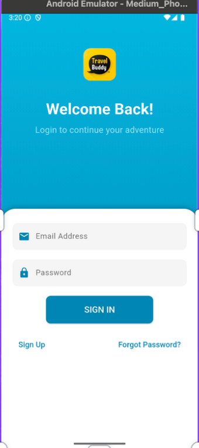
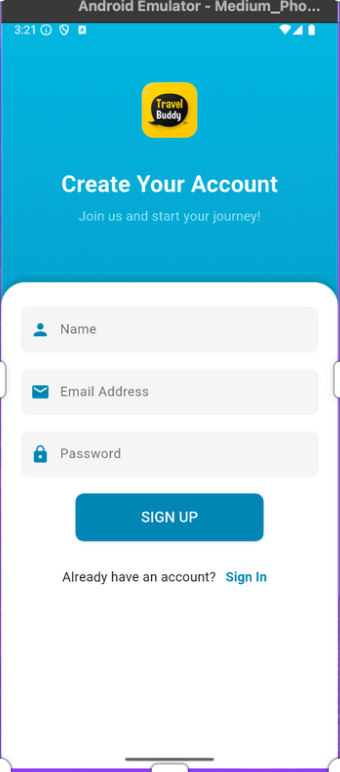
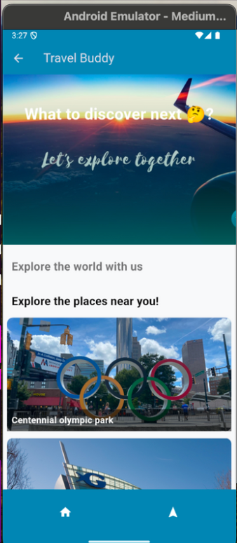
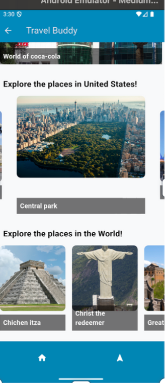
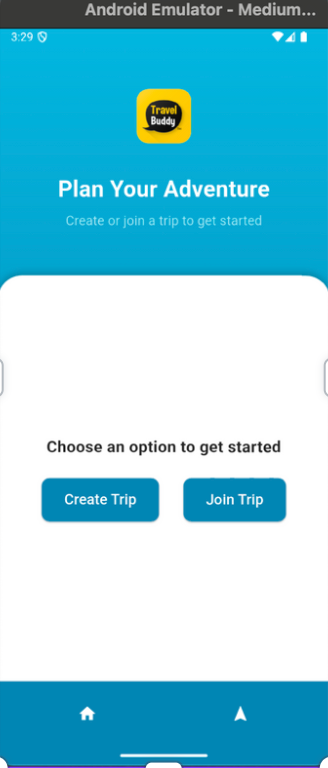
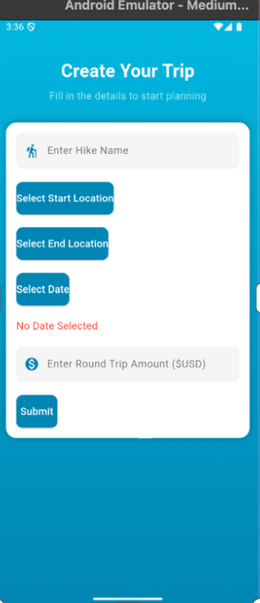
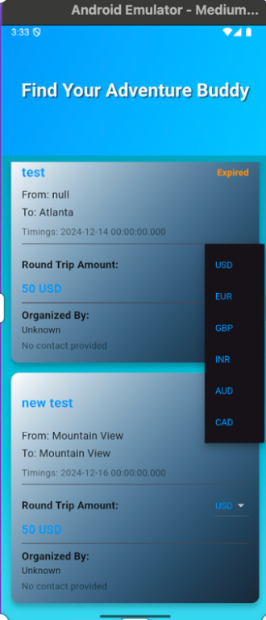
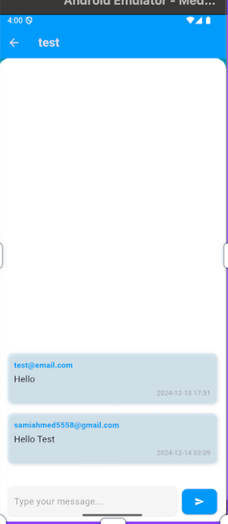
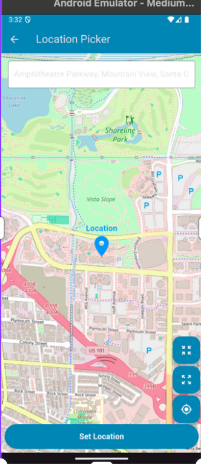

# 🌍 Travel Sphere 🧳

Welcome to **Travel Sphere**, the ultimate app for adventurers, wanderers, and travel enthusiasts! Whether you want to **create**, **join**, or **chat about hiking trips**, Travel Sphere has you covered. With its modern, blue-themed design, real-time features, and intuitive interface, your next adventure is just a tap away. 🏔️✨

---

## ✨ Features

### 🛤️ Core Functionalities:
1. **👤 User Authentication**:
   - Securely register and log in with Firebase Authentication.
   - Password protection with helpful error messages for a smooth experience.

2. **🚶‍♂️ Create & Join Trips**:
   - **Create Trips**: Enter details like start/end location, trip date, and cost.
   - **Join Trips**: Explore available trips and join them to meet like-minded adventurers.

3. **💬 Group Chat Integration**:
   - Communicate with trip members using real-time chat powered by Firebase Firestore.
   - Discuss plans, coordinate itineraries, and make friends before you even set out.

4. **📍 Location Search**:
   - Interactive map powered by OpenStreetMap for picking start and end points.
   - Discover places of interest easily and plan routes effortlessly.

5. **💱 Currency Conversion**:
   - View trip costs in multiple currencies using live exchange rates.
   - Perfect for international travelers who want clarity on costs.

6. **🎨 Beautiful UI**:
   - A consistent **blue-themed interface** with gradient backgrounds and card-based layouts.
   - Visually appealing and user-friendly design elements ensure a delightful experience.

---

## 📸 Screenshots

### Login & Registration
<div style="display: flex; justify-content: center; gap: 20px; flex-wrap: wrap;">
  
  
</div>

### Home & Explore
<div style="display: flex; justify-content: center; gap: 20px; flex-wrap: wrap;">
  
  
</div>

### Create & Join Trips
<div style="display: flex; justify-content: center; gap: 20px; flex-wrap: wrap;">
  
  
  
</div>

### Chat & Map
<div style="display: flex; justify-content: center; gap: 20px; flex-wrap: wrap;">
  
  
</div>


*Note: Update the above image paths according to your actual screenshot locations.*

---

## 🔧 Technology Stack

### Backend:
- **Firebase Firestore**: Real-time NoSQL database to store trips and messages.
- **Firebase Authentication**: Secure login and registration flows.
- **Currency Layer API**: Fetch live exchange rates for dynamic trip cost conversion.

### Frontend:
- **Flutter**: Cross-platform framework for building a polished, high-performance UI.
- **Dart**: The primary language for Flutter development.
- **OpenStreetMap Search and Pick**: Seamless integration of map functionalities.

---

## 🚀 How to Install and Run

### Step 1: Clone the Repository
  ```bash
  git clone https://github.com/SamiAhmed007/travel-sphere.git
  cd travel-sphere
  ```

### Step 2: Install Dependencies

Make sure you have Flutter installed on your system and run:
  ```bash
    flutter pub get
  ```

### Step 3: Run the Application
  ```bash
    flutter run
  ```

## 🛠️ Project Structure

```plaintext
lib/
├── capture.dart            # Capture trip-related media or data
├── chat_page.dart          # Real-time group chat for trip participants
├── createhike.dart         # Page to create a hiking trip
├── description.dart        # Detailed view of trip descriptions
├── firebase_options.dart   # Firebase configuration settings
├── group.dart              # Start and join group trips
├── helpers.dart            # Utility functions and reusable logic
├── home.dart               # Main dashboard with trip categories and content
├── join.dart               # Explore and join available trips
├── journey_details.dart    # Detailed view of journey information
├── login.dart              # User login page
├── main.dart               # Entry point of the application
├── register.dart           # User registration page
└── splash_screen.dart      # Splash screen with initial app loading
```
## 🌟 How It Works

1. **🚀 Authenticate**:
   - Start your journey by creating an account or logging in using Firebase Authentication.
   - Secure user login with password validation and error handling.

2. **🗺️ Create a Trip**:
   - Plan your adventure by creating a new trip.
   - Enter details like:
     - Trip **Title** 🎯
     - **Start Location** and **End Location** using OpenStreetMap.
     - Select a **Date** 📅 for the trip.
     - Specify the **Round Trip Cost** 💵.

3. **👥 Join a Trip**:
   - Explore available trips on the "Join" page.
   - View trip details, costs, and days left until the trip starts.
   - Currency conversion allows users to view the trip cost in multiple currencies dynamically.

4. **💬 Real-Time Chat**:
   - Connect with fellow travelers through **group chat**.
   - Share updates, discuss plans, and coordinate seamlessly.
   - Messages are displayed in real-time using Firebase Firestore.

5. **🎨 User Experience**:
   - Modern and consistent **blue-themed UI** with intuitive navigation.
   - Gradient backgrounds, clean cards, and interactive buttons enhance usability.
   - **Splash screen** for a smooth loading experience.

---

## 🎥 Demo and Presentation

- 📹 **YouTube Video**: [Watch the Demo](https://youtu.be/StOuMzQz6ZQ)
- 🖥️ **Presentation Slides**: [View the Presentation](https://docs.google.com/presentation/d/1E-ghhlMbQmHwFx3qanZ9WMoJ2-8jHfl3/edit?usp=sharing&ouid=102915569604651070374&rtpof=true&sd=true)

---

## 💡 Inspiration

Travel Sphere was inspired by the idea of bringing travelers closer together through shared adventures. 🌍 Whether you want to explore new destinations, meet new people, or create memorable experiences, Travel Sphere provides the tools to make it happen. 🧳✨

---

## 📬 Feedback

We'd love to hear from you! 💬 If you have suggestions, improvements, or encounter any issues:
- **Create an issue** in the GitHub repository.
- Reach out to us with your thoughts and ideas.

Let's build the ultimate travel app together! 🌟

